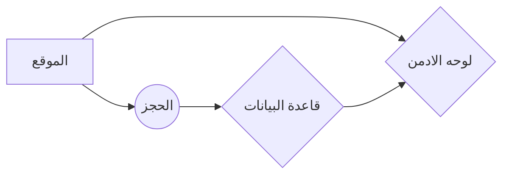

# PHP-Training-Hospital
 
## Files
تم استخدام 
**Normalize.css**   (version v8.0.1)

## Diagram

```mermaid
graph LR
A[الموقع] --> B((الحجز))
A --> C(لوحه الادمن)
B --> D{قاعدة البيانات}
D --> C{لوحه الادمن}
```